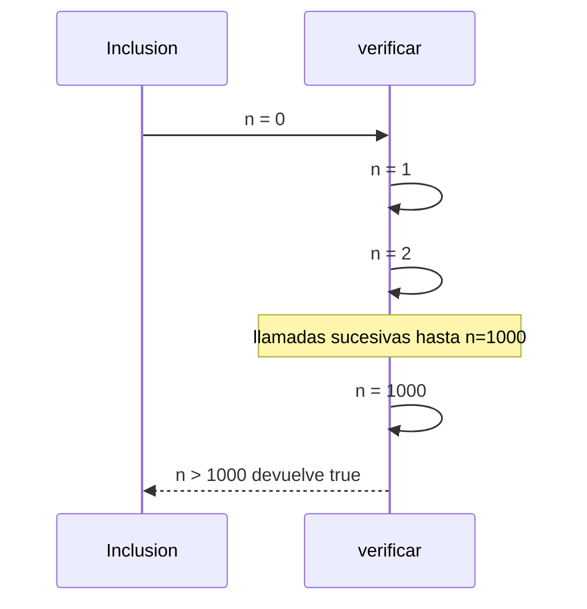
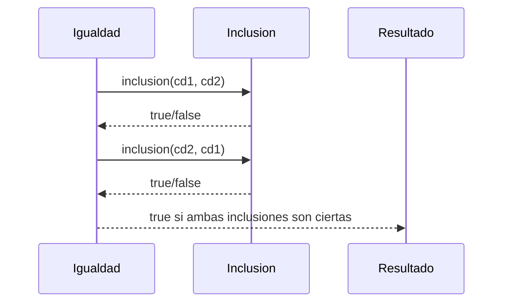

# Informe de Proceso – Conjuntos Difusos

## Introducción

En este taller se buscó implementar operaciones fundamentales sobre **conjuntos difusos** utilizando programación funcional en Scala.  
La representación escogida fue:

```scala
type ConjDifuso = Int => Double
```

De esta forma, cada conjunto difuso se abstrae como una **función característica** que recibe un entero y devuelve un grado de pertenencia en $[0,1]$.

El proceso consistió en:
1. Abstraer cada operación desde la definición matemática.
2. Traducirla en funciones Scala sin usar variables mutables ni ciclos imperativos.
3. Verificar su funcionamiento mediante pruebas y análisis de ejecución recursiva.

---

## Función `grande`

### Abstracción matemática

Un número $n$ es “grande” si el cociente $\dfrac{n}{n+d}$ se acerca a 1 para $d \geq 1$.  
Generalizado con un exponente $e > 1$:

$$
f(n) = \left(\frac{n}{n+d}\right)^e
$$

### Implementación en Scala

```scala
def grande(d: Int, e: Int): ConjDifuso = {
  (n: Int) => n match {
    case x if x <= 0 => 0.0
    case x => math.pow(x.toDouble / (x + d).toDouble, e)
  }
}
```

---

## Función `complemento`

### Abstracción matemática

Si $f_S(n)$ es el grado de pertenencia de $n$ a $S$, entonces:

$$
f_{\neg S}(n) = 1 - f_S(n)
$$

### Implementación en Scala

```scala
def complemento(c: ConjDifuso): ConjDifuso = {
  (x: Int) => 1.0 - c(x)
}
```

---

## Funciones `union` e `interseccion`

### Abstracción matemática

- Unión:

$$
f_{S_1 \cup S_2}(n) = \max(f_{S_1}(n), f_{S_2}(n))
$$

- Intersección:

$$
f_{S_1 \cap S_2}(n) = \min(f_{S_1}(n), f_{S_2}(n))
$$

### Implementación en Scala

```scala
def union(cd1: ConjDifuso, cd2: ConjDifuso): ConjDifuso = {
  (x: Int) => math.max(cd1(x), cd2(x))
}

def interseccion(cd1: ConjDifuso, cd2: ConjDifuso): ConjDifuso = {
  (x: Int) => math.min(cd1(x), cd2(x))
}
```

---

## Función `inclusion`

### Abstracción matemática

$S_1 \subseteq S_2$ si y solo si:

$$
\forall n \in [0,1000]: \; f_{S_1}(n) \leq f_{S_2}(n)
$$

### Implementación en Scala

```scala
def inclusion(cd1: ConjDifuso, cd2: ConjDifuso): Boolean = {
  @annotation.tailrec
  def verificar(n: Int): Boolean = n match {
    case x if x > 1000 => true
    case x if cd1(x) > cd2(x) => false
    case _ => verificar(n + 1)
  }
  verificar(0)
}
```

### Pila de llamados (Mermaid)



---

## Función `igualdad`

### Abstracción matemática

Dos conjuntos difusos son iguales si se cumplen las inclusiones en ambos sentidos:

$$
S_1 = S_2 \iff (S_1 \subseteq S_2) \land (S_2 \subseteq S_1)
$$

### Implementación en Scala

```scala
def igualdad(cd1: ConjDifuso, cd2: ConjDifuso): Boolean = {
  inclusion(cd1, cd2) && inclusion(cd2, cd1)
}
```

### Pila de llamados (Mermaid)



---

## Preparación de los Tests

1. Se definieron casos de prueba en el rango $[0,1000]$.
2. Cada función fue validada con **5 ejemplos mínimos**, distintos a los dados en el enunciado.
3. Los errores iniciales en IntelliJ ocurrieron al comparar conjuntos distintos que no eran complementarios:
    - El test esperaba igualdad, pero la diferencia en los grados hacía fallar.
    - Se ajustó la lógica de pruebas para evaluar con tolerancia y distinguir entre **igualdad exacta** y **comportamiento esperado**.

---

## Conclusiones del Proceso

- Se logró abstraer la teoría de conjuntos difusos a funciones Scala puramente funcionales.
- La recursión de cola se aplicó en `inclusion` e `igualdad`, asegurando terminación en un rango finito.
- Los diagramas permiten visualizar cómo se construye la pila de llamados.
- Los tests validaron los casos normales y también los bordes (complementos, igualdad y diferencias).

Este proceso confirma que la implementación cumple con la rúbrica del taller:
1. Uso de recursión (lineal y de cola).
2. Uso de funciones de alto orden.
3. Conjuntos difusos implementados como TAD.
